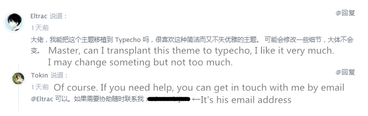

Language: [简体中文](README.md) | English

> The English editon of Adams is preparing now and being done by [KevinZonda](https://github.com/KevinZonda/). You can see it in [this repository](https://github.com/KevinZonda/adams).

# Theme Admas

## Introdution
This theme is transplanted from WordPress, the author is [Tokinx](https://github.com/Tokinx/Adams).  
I'm fond of this kind of themes. It's simple, graceful and functional. So I transplanted it to [Typecho](http://typecho.org)  

## Feauture
- Responsive Web design
- Only one bar and simple
- LightBox to view images better
- Sunset/Dark theme
- Instantclick
- Lightweight
- More to find

The changes relative to the raw version.
- Removed the "like" function.
- Removed the custom navigation.
- Removed the ajax comment.
- Removed the commenter wall.
- Hitokoto apear in the footer instead of the footer navigation.
- Separate English text and Chinese text by Pangu.js
- Less settings.

# Include
- [jQuery](https://github.com/jquery/jquery)
- [Prettify](https://github.com/google/code-prettify)
- [instantclick](https://github.com/dieulot/instantclick)
- [pangu.js](https://github.com/vinta/pangu.js)
- [Google Fonts](https://fonts.google.com)

# Copyright
Because the raw repository doesn't have a License file in it, so I get in touch with the author and he agreed.

# License
&copy; Under MIT License
